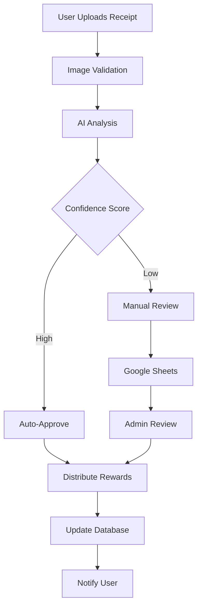
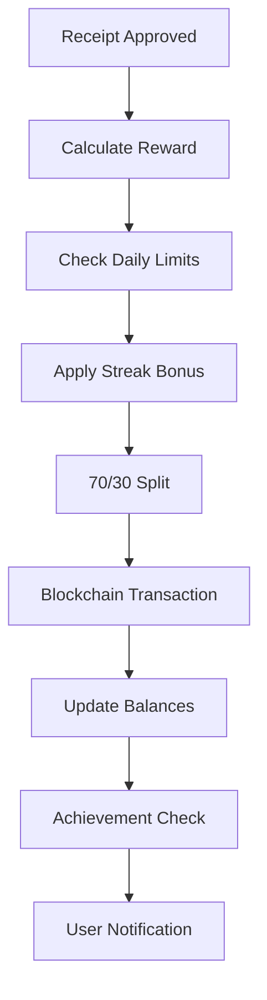

# ReCircle Architecture Documentation

## System Overview

ReCircle is a modern full-stack application built with TypeScript that integrates blockchain technology, AI-powered validation, and real-time user interactions to create a sustainable transportation rewards platform.

## 🏗️ High-Level Architecture

```
┌─────────────────┐    ┌─────────────────┐    ┌─────────────────┐
│   Frontend      │    │    Backend      │    │   Blockchain    │
│   (React)       │◄──►│   (Express)     │◄──►│   (VeChain)     │
│                 │    │                 │    │                 │
│ • Components    │    │ • API Routes    │    │ • Smart         │
│ • State Mgmt    │    │ • Business      │    │   Contracts     │
│ • VeChain SDK   │    │   Logic         │    │ • B3TR Tokens   │
│ • UI/UX         │    │ • Database      │    │ • VeBetterDAO   │
└─────────────────┘    └─────────────────┘    └─────────────────┘
         │                       │                       │
         │              ┌─────────────────┐              │
         └─────────────►│   External      │◄─────────────┘
                        │   Services      │
                        │                 │
                        │ • OpenAI API    │
                        │ • Google Sheets │
                        │ • PostgreSQL    │
                        └─────────────────┘
```

## 🎨 Frontend Architecture

### Core Technologies
- **React 18**: Modern React with Hooks and Context
- **TypeScript**: Type safety throughout the application
- **Vite**: Fast build tool and development server
- **Tailwind CSS**: Utility-first CSS framework
- **shadcn/ui**: Professional component library

### Component Structure
```
src/
├── components/           # Reusable UI components (70+)
│   ├── ui/              # Base shadcn/ui components
│   ├── icons/           # SVG icon components
│   ├── AchievementCard.tsx
│   ├── ActivityCard.tsx
│   ├── UnifiedWalletButton.tsx
│   └── ...
├── pages/               # Route-based page components
│   ├── welcome.tsx      # Professional onboarding
│   ├── home.tsx         # Main dashboard
│   ├── scan.tsx         # Receipt scanning
│   └── ...
├── context/             # React Context providers
│   ├── WalletContext.tsx
│   └── AchievementContext.tsx
├── lib/                 # Utilities and configurations
│   ├── queryClient.ts   # TanStack Query setup
│   ├── utils.ts         # Helper functions
│   └── vechain.ts       # VeChain integration
└── hooks/               # Custom React hooks
    ├── use-toast.ts
    └── useVeWorldWallet.ts
```

### State Management
- **TanStack React Query**: Server state management
- **React Context**: Global application state
- **Local State**: Component-specific state with useState/useReducer

### VeChain Integration
```typescript
// VeChain wallet connection
const connex = new Connex({
  node: 'https://testnet.veblocks.net',
  network: 'test'
});

// Transaction signing
const clause = {
  to: contractAddress,
  value: '0',
  data: encodedFunctionCall
};

const tx = await connex.vendor.sign('tx', [clause]);
```

## 🔧 Backend Architecture

### Core Technologies
- **Node.js**: JavaScript runtime
- **Express.js**: Web application framework
- **TypeScript**: Type-safe server development
- **Drizzle ORM**: Type-safe database operations
- **PostgreSQL**: Primary database

### Service Layer Structure
```
server/
├── routes/              # API endpoint definitions
│   ├── routes.ts        # Main route configuration
│   └── receipt.ts       # Receipt-specific routes
├── utils/               # Business logic services
│   ├── distributeReward-connex.ts  # Blockchain rewards
│   ├── openai.ts        # AI receipt validation
│   ├── receiptUtils.ts  # Receipt processing
│   └── rewardLogic.ts   # Reward calculations
├── middlewares/         # Express middlewares
│   ├── rateLimiting.ts  # API protection
│   └── json-response.ts # Response formatting
├── db/                  # Database configuration
│   └── schema.ts        # Database schema definitions
└── storage.ts           # Data access layer
```

### API Design
```typescript
// RESTful API endpoints
POST /api/receipts              # Submit receipt for validation
GET  /api/users/:id/transactions # User transaction history
POST /api/rewards/distribute    # Distribute B3TR tokens
GET  /api/achievements/:userId  # User achievements
POST /api/google-form-submission # Manual review webhook
```

### Database Schema
```sql
-- Core entities
Users (id, walletAddress, createdAt, dailyStreak)
Receipts (id, userId, imageHash, status, confidence)
Transactions (id, userId, type, amount, blockchainTxId)
Achievements (id, userId, type, unlockedAt, metadata)
Stores (id, name, category, autoApproved, location)
```

## 🔗 Blockchain Integration

### VeChain Thor Network
- **Testnet**: Development and testing
- **Mainnet**: Production deployment
- **Connex SDK**: Official VeChain JavaScript library

### Smart Contract Interaction
```typescript
// B3TR token distribution via VeBetterDAO
const distributeReward = async (
  userAddress: string,
  amount: number,
  appFundAmount: number
) => {
  // 70% to user
  await distributeTo(userAddress, amount * 0.7);
  
  // 30% to app fund
  await distributeTo(appFundWallet, amount * 0.3);
};
```

### Wallet Integration
- **VeWorld Mobile**: Primary wallet for users
- **Connection Methods**: QR code, deep linking
- **Security**: Certificate-based authentication

## 🧠 AI Integration

### OpenAI Vision API
```typescript
// Receipt validation with GPT-4o
const validateReceipt = async (imageBase64: string) => {
  const response = await openai.chat.completions.create({
    model: "gpt-4o",
    messages: [{
      role: "user",
      content: [
        { type: "text", text: "Analyze this transportation receipt..." },
        { type: "image_url", image_url: { url: imageBase64 } }
      ]
    }]
  });
  
  return JSON.parse(response.choices[0].message.content);
};
```

### Validation Pipeline
1. **Image Upload**: User submits receipt image
2. **Preprocessing**: Image optimization and validation
3. **AI Analysis**: OpenAI extracts receipt data
4. **Business Rules**: Apply transportation service rules
5. **Decision**: Auto-approve or flag for manual review

## 🔒 Security Architecture

### Authentication & Authorization
- **Session-based**: Express sessions with PostgreSQL store
- **Wallet Verification**: VeChain signature validation
- **Route Protection**: Middleware-based access control

### Rate Limiting
```typescript
// Multi-tier rate limiting
const rateLimits = {
  receipt_submission: { windowMs: 60000, max: 5 },
  general_api: { windowMs: 60000, max: 100 },
  auth_endpoints: { windowMs: 900000, max: 5 }
};
```

### Fraud Prevention
- **Duplicate Detection**: SHA-256 image hashing
- **Content Validation**: AI-powered receipt analysis
- **Pattern Recognition**: Suspicious activity monitoring
- **Manual Review**: Google Sheets integration for edge cases

## 📊 Data Flow

### Receipt Submission Flow


### Reward Distribution Flow


## 🚀 Deployment Architecture

### Development Environment
- **Platform**: Replit with hot reload
- **Database**: PostgreSQL development instance
- **Networking**: Local development server
- **Testing**: Comprehensive test suite

### Production Environment
- **Hosting**: Replit Autoscale Deployment
- **Specifications**: 4 vCPU / 8 GiB RAM / 3 Max Instances
- **Database**: Production PostgreSQL with connection pooling
- **CDN**: Static asset optimization
- **Monitoring**: Real-time error tracking and performance metrics

### Scaling Strategy
- **Horizontal Scaling**: Auto-scaling instances based on traffic
- **Database Optimization**: Connection pooling and query optimization
- **Caching**: In-memory caching for frequently accessed data
- **Load Balancing**: Automatic request distribution

## 🔧 Configuration Management

### Environment Variables
```env
# Core Application
NODE_ENV=production
PORT=5000
DATABASE_URL=postgresql://...

# Blockchain
VECHAIN_NETWORK=mainnet
REWARD_DISTRIBUTOR_WALLET=0x...
APP_FUND_WALLET=0x...

# External Services
OPENAI_API_KEY=sk-...
GOOGLE_SHEETS_WEBHOOK_URL=https://...

# Security
SESSION_SECRET=...
CORS_ORIGIN=https://...
```

### Build Configuration
- **Vite**: Modern build tool with optimizations
- **TypeScript**: Strict type checking
- **Tailwind**: CSS optimization and purging
- **ESLint/Prettier**: Code quality and formatting

## 📈 Performance Considerations

### Frontend Optimization
- **Code Splitting**: Route-based lazy loading
- **Bundle Analysis**: Webpack bundle analyzer
- **Image Optimization**: Optimized asset delivery
- **Caching**: Service worker implementation

### Backend Optimization
- **Database Indexing**: Optimized query performance
- **Connection Pooling**: Efficient database connections
- **Compression**: Gzip response compression
- **Memory Management**: Garbage collection optimization

### Monitoring & Analytics
- **Performance Metrics**: Response time tracking
- **Error Monitoring**: Real-time error alerts
- **User Analytics**: Usage pattern analysis
- **Blockchain Monitoring**: Transaction success rates

This architecture supports ReCircle's mission of creating a scalable, secure, and user-friendly platform for sustainable transportation rewards while maintaining professional development standards and blockchain integration best practices.